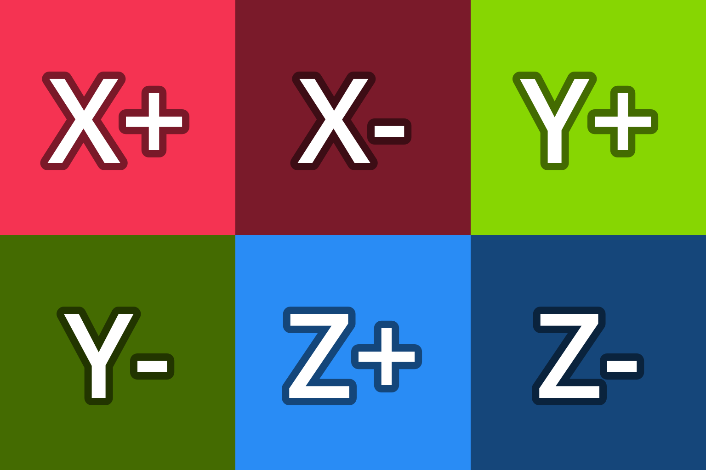
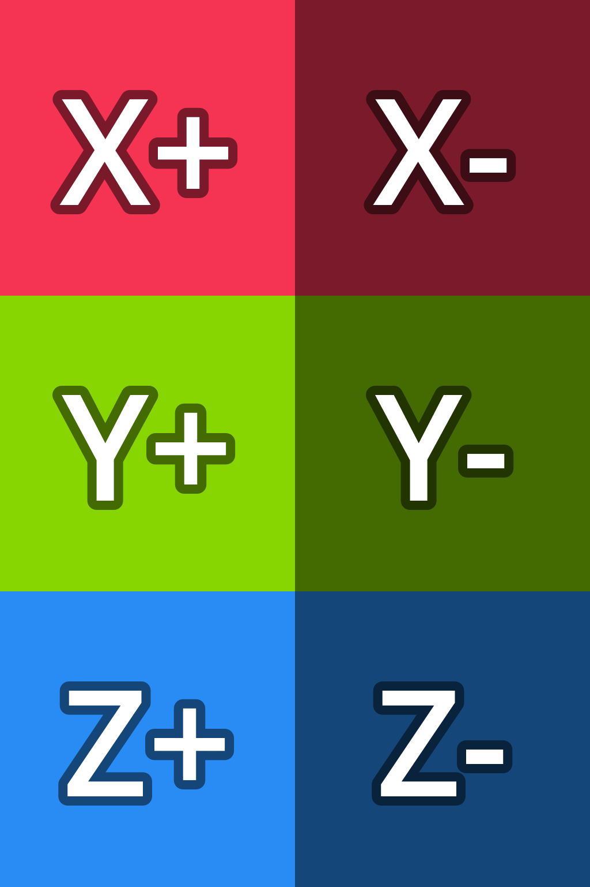
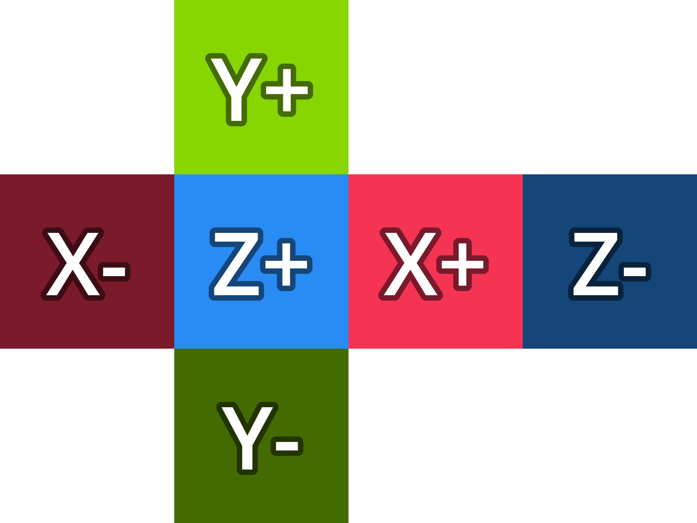
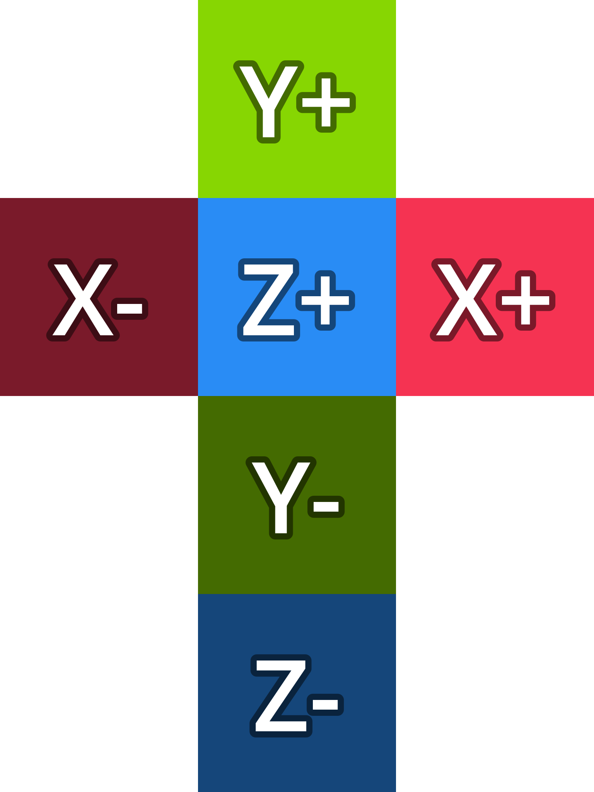
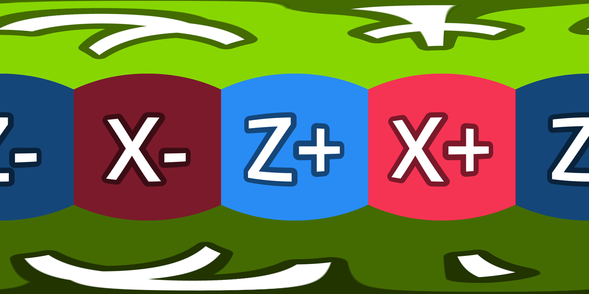

# 🗺️ Cubemap format converter

An online tool to convert cubemaps between different formats.

## Supported formats

Upon uploading an image, the current format will be automatically detected.  
The example cubemap images are taken from the [Godot documentation](https://docs.godotengine.org/en/stable/classes/class_cubemap.html).

| Format           |                               Example                               |
| :--------------- | :-----------------------------------------------------------------: |
| Row (6x1)        |               |
| Column (1x6)     |              |
| Row (3x2)        |               |
| Column (2x3)     |              |
| Horizontal Cross |  |
| Vertical Cross   |   |
| Equirectangular  |   |

You can use this image to test the tool (from [Learn OpenGL](https://learnopengl.com/Advanced-OpenGL/Cubemaps)):


## Project Setup

This project is made with Vue.js.

### Install dependencies

```sh
npm install
```

### Compile and Hot-Reload for Development

```sh
npm run dev
```

### Type-Check, Compile and Minify for Production

```sh
npm run build
```
